# KTHub UML Diagram Drafts

**Document status:** Draft for review  
**Project:** KTHub - Knowledge Transfer Hub  
**Repository:** https://github.com/vigneshreddyputluri/KTHub  
**Local path:** `C:\Users\VIGNESH\Desktop\KTHub`  
**Prepared on:** 19 April 2026  
**Prepared for:** Project design review and final UML documentation

## 1. Reference

This document uses the UML diagram categories described by GeeksforGeeks as a baseline reference. The article explains UML as a standard visual language used to model system structure and behavior, and classifies UML diagrams into structural diagrams and behavioral diagrams.

**Citation:** GeeksforGeeks. "Unified Modeling Language (UML) Diagrams." Last updated 16 April 2026. Available at: https://www.geeksforgeeks.org/system-design/unified-modeling-language-uml-introduction/. Accessed 19 April 2026.

## 2. Project Understanding

KTHub is a Knowledge Transfer platform where users can discover, create, teach, improve, and reuse structured KT modules. The current Release 0.2 implementation is a clickable MVP with a static browser frontend, localStorage-backed mock persistence, and a Node.js/Express backend foundation exposing REST-style mock API endpoints.

Positioning line: **Enhancing learning through collective knowledge enrichment.**

The project documentation and source code identify the following main functional areas:

- KT discovery and filtering.
- Learner and mentor view modes.
- Conceptual and technical KT categories.
- KT detail viewing.
- KT creation as a local draft.
- Contribution proposal submission.
- Assignment curation.
- Institution account model and association request workflow.
- Membership-based institution admin detection.
- Mock backend APIs for KTs, assignments, contributions, accounts, institutions, memberships, and association requests.

## 3. UML Diagram Applicability Matrix

| UML Diagram Type | Recommended for KTHub | Purpose in This Project | Draft Status |
| --- | --- | --- | --- |
| Use Case Diagram | Yes | Shows actors and system-level functionality. | Included |
| Class Diagram | Yes | Shows major domain entities and relationships. | Included |
| Object Diagram | Optional | Shows sample runtime object instances for one scenario. | Included as optional draft |
| Component Diagram | Yes | Shows frontend, backend, mock data, browser storage, and future database direction. | Included |
| Deployment Diagram | Yes | Shows current local MVP deployment and future production architecture. | Included |
| Package Diagram | Yes | Shows logical grouping of modules and documentation areas. | Included |
| Activity Diagram | Yes | Shows workflow steps for core business processes. | Included |
| Sequence Diagram | Yes | Shows interaction order for contribution and institution association flows. | Included |
| State Machine Diagram | Yes | Shows lifecycle of contribution proposal and institution association request. | Included |
| Communication Diagram | Optional | Similar coverage to sequence diagrams; may be added if required by submission format. | Not included in first draft |
| Composite Structure Diagram | Not required currently | Useful when modeling internals of a complex component; current MVP is too lightweight. | Not recommended now |
| Interaction Overview Diagram | Optional | Useful for summarizing multiple workflows at a high level. | Included as activity-style overview |
| Timing Diagram | Not required currently | Useful for time-bound or real-time systems; KTHub has no such requirement in v0.2. | Not recommended now |

## 4. Draft 1 - Use Case Diagram

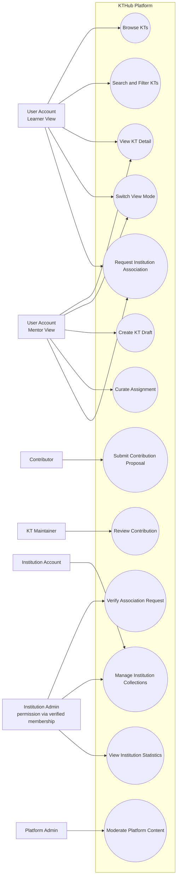

### Review Notes

- Learner and mentor are treated as view modes, not separate account types.
- Institution admin is represented as a permission derived from verified institution membership, not as an account type.
- Platform admin is included as a future operational actor from the architecture documentation.

## 5. Draft 2 - Domain Class Diagram

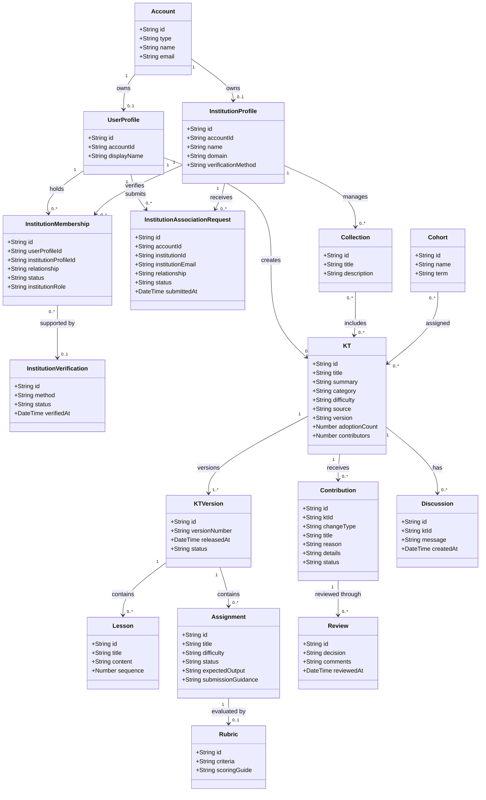

### Review Notes

- This diagram combines the current MVP fields with planned Release 0.3 backend entities.
- Cardinalities are draft assumptions based on `docs/architecture.md` and `docs/account-and-institution-model.md`.
- `Account.type` should be restricted to `user` or `institution` in production.

## 6. Draft 3 - Component Diagram

```mermaid
flowchart TB
  Browser[User Browser]

  subgraph Frontend[Frontend - app folder]
    HTML[index.html]
    CSS[styles.css]
    JS[script.js]
    HashRouter[Hash Routing]
    LocalStorage[Browser localStorage]
  end

  subgraph Backend[Backend - server folder]
    Express[Node.js Express Server]
    ApiRoutes[REST API Routes]
    MockData[mockData.js]
  end

  subgraph Future[Future Production Services]
    Auth[Authentication and Authorization]
    Database[(PostgreSQL Database)]
    Search[Search Service]
    ObjectStorage[(Object Storage)]
    Integrations[LMS, SSO, GitHub, Classroom Integrations]
  end

  Browser --> HTML
  HTML --> CSS
  HTML --> JS
  JS --> HashRouter
  JS --> LocalStorage
  Browser --> Express
  Express --> HTML
  Express --> ApiRoutes
  ApiRoutes --> MockData

  ApiRoutes -. Release 0.3 .-> Auth
  ApiRoutes -. Release 0.3 .-> Database
  ApiRoutes -. Future .-> Search
  ApiRoutes -. Future .-> ObjectStorage
  ApiRoutes -. Future .-> Integrations
```

### Review Notes

- Release 0.2 uses localStorage in the browser and mock in-memory backend data.
- The backend foundation already has endpoints for KTs, assignments, contributions, current account, institutions, memberships, and association requests.
- Future components are shown as planned architecture, not current implementation.

## 7. Draft 4 - Deployment Diagram

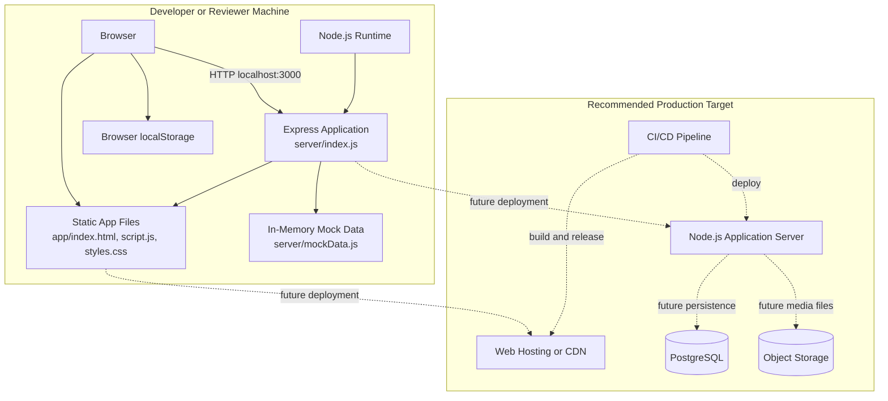

### Review Notes

- Current review can be performed by opening `app/index.html` directly or by running the Express server.
- Production deployment should separate durable persistence from mock/local state.

## 8. Draft 5 - Package Diagram

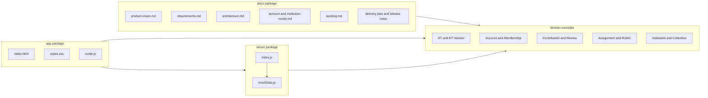

### Review Notes

- This diagram is repository-oriented and useful for project documentation.
- If the project is upgraded to React/Next.js, this package diagram should be revised into feature modules.

## 9. Draft 6 - Activity Diagram: KT Discovery and Contribution

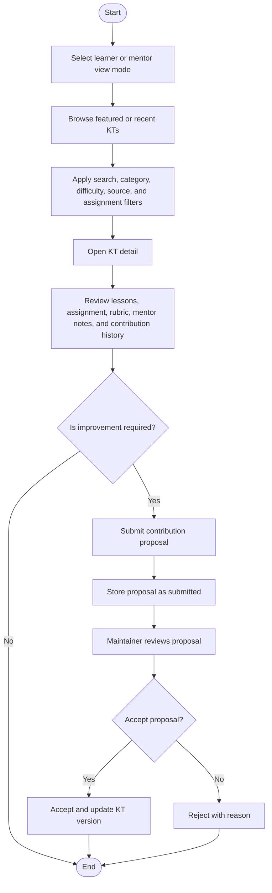

### Review Notes

- The current MVP implements proposal submission.
- Maintainer review, acceptance, rejection, and KT version updates are planned capabilities.

## 10. Draft 7 - Activity Diagram: Institution Association

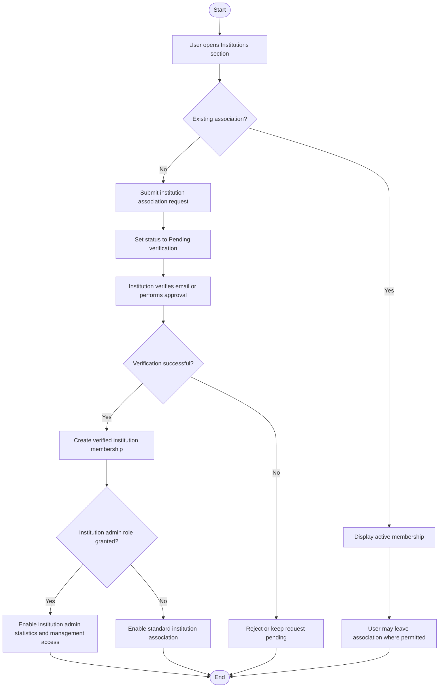

### Review Notes

- The current MVP stores association requests locally.
- Verified membership creation and approval authority are planned backend features.

## 11. Draft 8 - Sequence Diagram: Submit Contribution Proposal

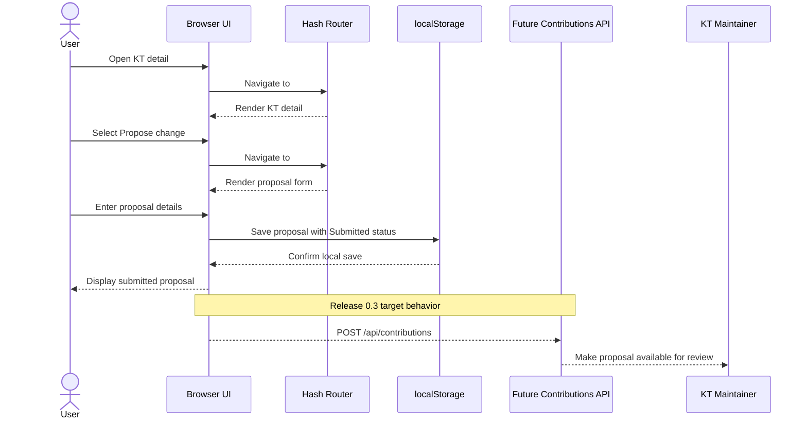

### Review Notes

- Release 0.2 uses localStorage for browser-submitted proposals.
- The Express backend already has `POST /api/contributions`, which can be connected from the frontend in a future release.

## 12. Draft 9 - Sequence Diagram: Institution Association Request

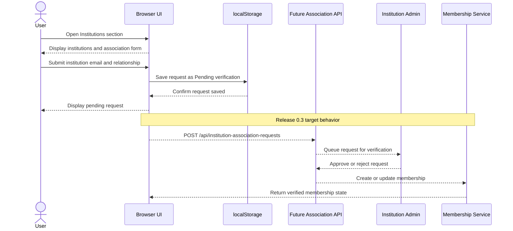

### Review Notes

- Institution association is a formal business workflow and should be part of the final UML submission.
- Admin access must be inferred from verified membership role.

## 13. Draft 10 - State Machine Diagram: Contribution Proposal

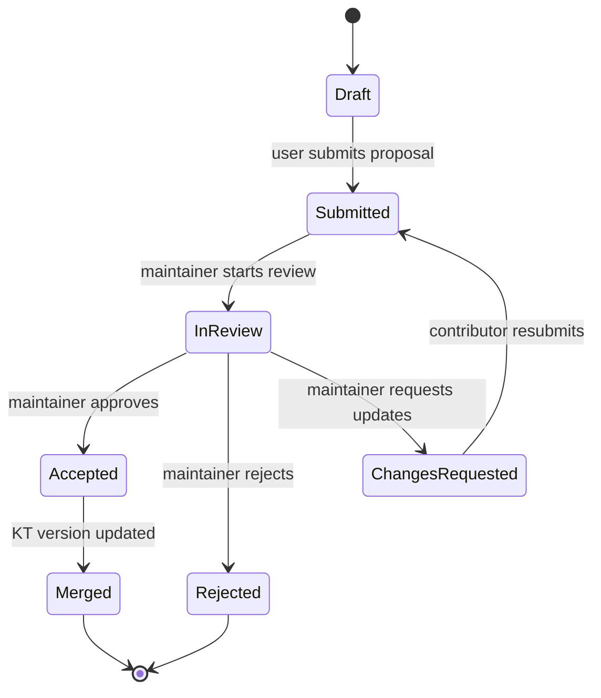

### Review Notes

- Current mock data includes `Submitted` and `In Review`.
- `Accepted`, `Rejected`, `Changes Requested`, and `Merged` are recommended for production workflow completeness.

## 14. Draft 11 - State Machine Diagram: Institution Association Request

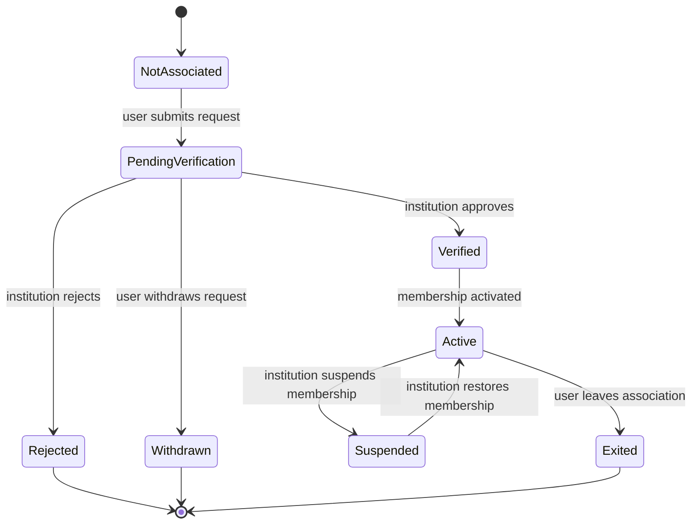

### Review Notes

- This aligns with the documented lifecycle: joined/requested, approved, rejected, suspended, and exited.
- The final diagram can be simplified if the evaluator expects only MVP states.

## 15. Draft 12 - Object Diagram: Sample KT Instance

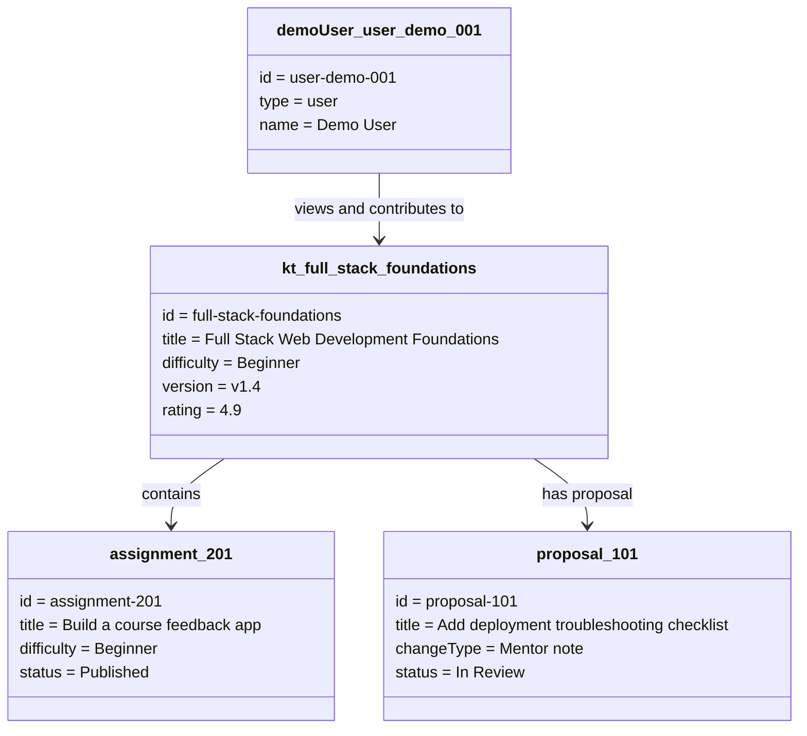

### Review Notes

- Object diagrams are not mandatory but are helpful when explaining mock data and runtime examples.
- This diagram is based on values present in `server/mockData.js` and `app/script.js`.

## 16. Draft 13 - Interaction Overview Diagram

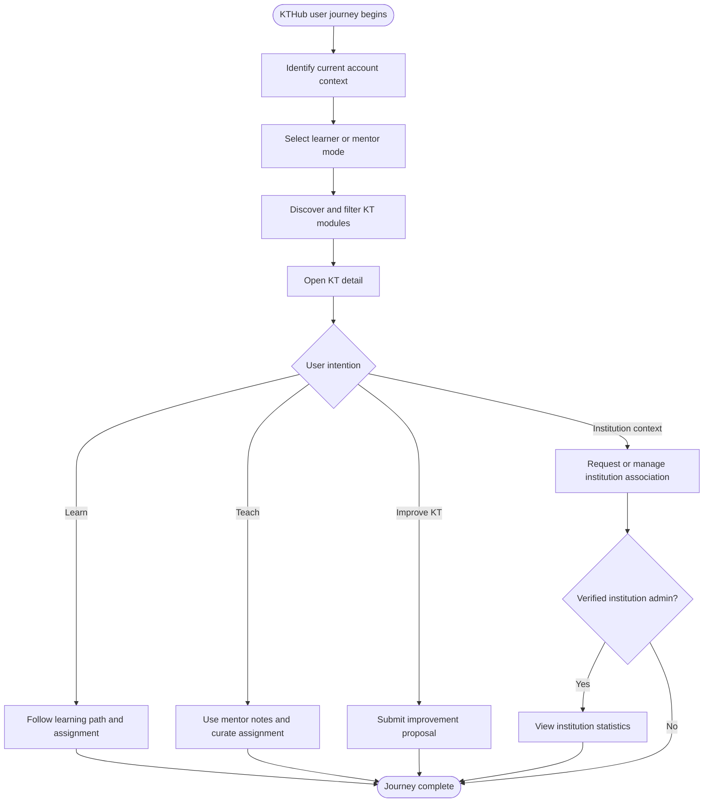

### Review Notes

- This gives a management-friendly overview of the main KTHub flows.
- It can be used in presentations before showing detailed activity or sequence diagrams.

## 17. Recommended Final Diagram Set

For a formal academic or corporate submission, the following final set is recommended:

1. Use Case Diagram.
2. Domain Class Diagram.
3. Component Diagram.
4. Deployment Diagram.
5. Package Diagram.
6. Activity Diagram for KT discovery and contribution.
7. Activity Diagram for institution association.
8. Sequence Diagram for contribution proposal.
9. Sequence Diagram for institution association request.
10. State Machine Diagram for contribution proposal.
11. State Machine Diagram for institution association request.

The optional object diagram and interaction overview diagram may be included as supporting diagrams if the final document requires broader coverage.

## 18. Open Review Points

The following items should be confirmed before finalization:

1. Whether the final diagrams should represent only Release 0.2 or the planned Release 0.3 backend MVP as well.
2. Whether the final submission expects strict UML notation in a tool such as StarUML, Visual Paradigm, or draw.io.
3. Whether contribution review roles should include a separate reviewer role or be merged into KT maintainer.
4. Whether institution collection management should be included in the MVP-level diagrams or kept as future scope.
5. Whether platform admin should be retained in final diagrams, because it is documented in architecture but not implemented in Release 0.2.
